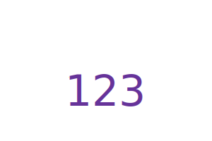

# 10-Node.js-Command-Line-logo.svg-Generator
 

## Description
A Node.js command-line application that takes in user input to generate a logo and save it as an [SVG file](https://en.wikipedia.org/wiki/Scalable_Vector_Graphics). The application prompts the user using the [Inquirer package](https://www.npmjs.com/package/inquirer/v/8.2.4) to select a color and shape, provide text for the logo, and save the generated SVG to `logo.svg`.

## Table of Contents
- [Installation](#installation)
- [Usage](#usage)
- [License](#license)
- [Contributing](#contributing)
- [Tests](#tests)
- [Questions](#questions)

## Installation
To generate the SVG, the user needs to clone this [repository](https://github.com/hjlee17/10-node.js-command-line-logo.svg-maker.git/). Install [Node.js](https://nodejs.org/), and use the ```npm init -y``` to initialize, and then use the ```npm i``` command to install the dependencies [Inquirer](https://www.npmjs.com/package/inquirer/v/8.2.4) and [Jest](https://www.npmjs.com/package/jest/v/24.9.0).

## Usage
Invoke the application by by using the following command:
```bash
node index.js
``` 
and answer the prompts accordingly. 
1. The user will be required to input up to three characters to use for their logo. Letters are case sensitive and will reflect in the logo as the user inputted them.
2. The user will be required to input a color for the characters using a keyword or a hexadecimal number (do not forgot the # for a hexadecimal number).
3. The user will be required to select the shape of their desired logo from the choices of circle, square, and triangle.
4. The user will be required to input the same way as the logo text color.


A file titled [logo.svg](./output/logo.svg) will be generated in the [output](./output) directory. Rename this file or copy to a new location; running the application again will overwrite the generated SVG file because it will use the same filename.

There is a sample logo [VideoDemoLogo.svg](./output/VideoDemoLogo.svg)in the [output](./output) directory that matches the video demonstration below. 
[Video Demonstration](https://drive.google.com/file/d/1Bzk8k42iTB7CLJ3aYgEgbcfHBgfjoSRH/view?usp=share_link)

Below is a screenshot of the command terminal after prompts have been answered and [logo.svg](./output/logo.svg) has been generated per the user inputs. The user inputs in the command terminal match the values in [logo.svg](./output/logo.svg).


Below are three more examples of logos generated using the application in varying shapes, colors, and text. They can be found in the [examples](./examples) directory.  




## License
[The MIT License](https://opensource.org/licenses/MIT/)

## Contributing
- [SVG tutorial](https://developer.mozilla.org/en-US/docs/Web/SVG/Tutorial)
- [Basic SVG shapes](https://developer.mozilla.org/en-US/docs/Web/SVG/Tutorial/Basic_Shapes)
- [Text in SVG](https://developer.mozilla.org/en-US/docs/Web/SVG/Tutorial/Texts)
- BootCampSpot

## Tests
To run unit tests use the ```npm run test``` command. There are 5 test suites.

## Questions
- Github: [hjlee17](https://github.com/hjlee17)